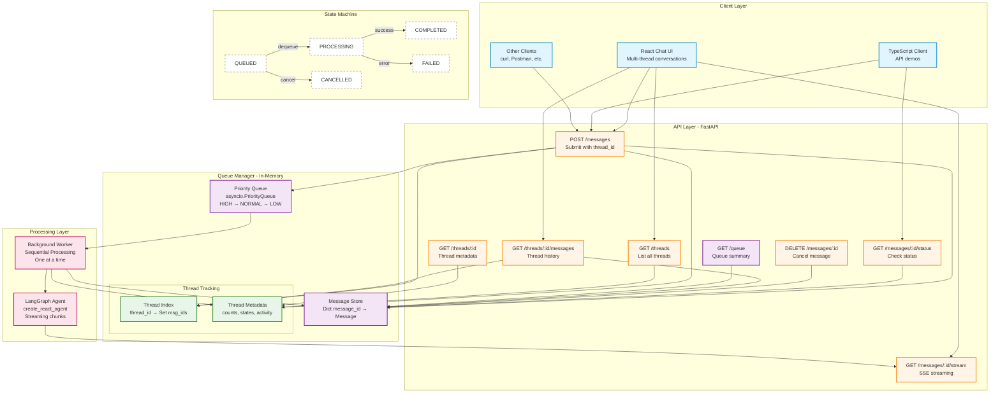

# Architecture Documentation

This document provides detailed technical information about the Agent Queue System's architecture, including implementation specifics, data structures, and API references.

For a high-level conceptual overview, see the [README Architecture Section](../README.md#architecture).

## Table of Contents
- [Detailed System Diagram](#detailed-system-diagram)
- [Component Details](#component-details)
- [API Reference](#api-reference)
- [Data Structures](#data-structures)
- [Thread Tracking Implementation](#thread-tracking-implementation)
- [State Machine](#state-machine)
- [Performance Characteristics](#performance-characteristics)

## Detailed System Diagram



## Component Details

### Client Layer

**React Chat UI** (`examples/chat-ui/`)
- Full-featured chat interface with thread support
- Real-time SSE streaming display
- Message state visualization
- Thread sidebar with metadata

**TypeScript Client** (`examples/typescript-client/`)
- Demonstrates all API endpoints
- Includes threading examples
- Console logging for debugging

**HTTP Clients**
- Any REST client can interact with the API
- curl, Postman, HTTPie, etc.

### API Layer (FastAPI)

**Message Endpoints:**
- `POST /messages` - Submit new message with optional `thread_id` and `priority`
- `GET /messages/{id}/status` - Check message status and results
- `GET /messages/{id}/stream` - SSE streaming of agent response
- `DELETE /messages/{id}` - Cancel queued message

**Thread Endpoints:**
- `GET /threads` - List all threads sorted by last activity
- `GET /threads/{id}/messages` - Get all messages in a thread (chronological)
- `GET /threads/{id}` - Get thread metadata with state counts

**System Endpoints:**
- `GET /queue` - Queue summary with counts by state
- `GET /health` - Health check

### Queue Manager (In-Memory)

**Priority Queue** (`src/shinzo/queue/manager.py`)
- Uses `asyncio.PriorityQueue` for ordering
- Priority mapping: HIGH=1, NORMAL=2, LOW=3
- FIFO within same priority using counter
- Thread-safe with `asyncio.Lock`

**Message Store**
- Dictionary: `message_id → QueuedMessage`
- Stores all message metadata
- Persists state transitions
- Tracks streaming chunks

**Thread Tracking:**
- `_thread_index`: Maps `thread_id` to set of `message_ids`
- `_thread_metadata`: Stores per-thread statistics
- O(1) lookups for thread queries
- Automatic metadata updates on state changes

### Processing Layer

**Background Worker** (`src/shinzo/worker/manager.py`)
- Runs as asyncio background task
- Waits for queue events
- Dequeues one message at a time
- Processes sequentially (no parallelism)
- Handles graceful shutdown

**LangGraph Agent** (`src/shinzo/agent/processor.py`)
- Uses `create_react_agent` from LangGraph
- Captures streaming chunks during processing
- Stores chunks in message metadata
- Constructs full response on completion

## API Reference

### POST /messages

Submit a new message to the queue.

**Request Body:**
```json
{
  "message": "What is Python?",
  "priority": "normal",  // "high", "normal", or "low"
  "thread_id": "thread-123"  // optional
}
```

**Response (202 Accepted):**
```json
{
  "message_id": "550e8400-e29b-41d4-a716-446655440000",
  "state": "queued",
  "queue_position": 3,
  "created_at": "2024-01-15T10:00:00.000Z",
  "thread_id": "thread-123"
}
```

### GET /messages/{id}/status

Get current status of a message.

**Response (200 OK):**
```json
{
  "message_id": "550e8400-e29b-41d4-a716-446655440000",
  "state": "completed",
  "user_message": "What is Python?",
  "priority": "normal",
  "created_at": "2024-01-15T10:00:00.000Z",
  "started_at": "2024-01-15T10:00:05.000Z",
  "completed_at": "2024-01-15T10:00:15.000Z",
  "result": "Python is a high-level programming language...",
  "error": null,
  "queue_position": null,
  "thread_id": "thread-123"
}
```

### GET /messages/{id}/stream

Stream agent response via Server-Sent Events.

**SSE Events:**
- `queued` - Message is waiting in queue
- `processing` - Agent started processing
- `chunk` - Agent generated a chunk of response
- `done` - Processing completed successfully
- `error` - Processing failed
- `cancelled` - Message was cancelled

**Example Event:**
```
event: chunk
data: {"chunk": "Python is "}

event: chunk
data: {"chunk": "a high-level "}

event: done
data: {"result": "Python is a high-level programming language..."}
```

### DELETE /messages/{id}

Cancel a queued message (only works if state is QUEUED).

**Response (200 OK):**
```json
{
  "message_id": "550e8400-e29b-41d4-a716-446655440000",
  "state": "cancelled"
}
```

### GET /threads

List all threads sorted by last activity (most recent first).

**Response (200 OK):**
```json
[
  {
    "thread_id": "thread-123",
    "message_count": 5,
    "created_at": "2024-01-15T10:00:00.000Z",
    "last_activity": "2024-01-15T10:30:00.000Z",
    "last_message_preview": "Can you explain decorators?"
  }
]
```

### GET /threads/{id}/messages

Get all messages in a thread (chronological order).

**Response (200 OK):**
```json
{
  "thread_id": "thread-123",
  "total_messages": 3,
  "messages": [
    { /* MessageStatusResponse */ },
    { /* MessageStatusResponse */ },
    { /* MessageStatusResponse */ }
  ]
}
```

### GET /threads/{id}

Get thread metadata with state counts.

**Response (200 OK):**
```json
{
  "thread_id": "thread-123",
  "message_count": 5,
  "created_at": "2024-01-15T10:00:00.000Z",
  "last_activity": "2024-01-15T10:30:00.000Z",
  "states": {
    "queued": 0,
    "processing": 1,
    "completed": 4,
    "failed": 0,
    "cancelled": 0
  }
}
```

### GET /queue

Get queue summary with message counts.

**Response (200 OK):**
```json
{
  "total_queued": 3,
  "total_processing": 1,
  "total_completed": 42,
  "total_failed": 2,
  "total_cancelled": 1,
  "queued_messages": [
    {
      "id": "msg-1",
      "priority": "high",
      "created_at": "2024-01-15T10:00:00.000Z",
      "user_message": "Urgent question..."
    }
  ],
  "current_processing": {
    "id": "msg-2",
    "priority": "normal",
    "started_at": "2024-01-15T10:00:05.000Z",
    "user_message": "What is..."
  }
}
```

## Data Structures

### QueuedMessage

Core message model stored in Queue Manager.

```python
class QueuedMessage(BaseModel):
    id: str  # UUID
    user_message: str  # User's input text
    priority: Priority  # HIGH, NORMAL, or LOW
    state: MessageState  # QUEUED, PROCESSING, COMPLETED, FAILED, CANCELLED
    thread_id: Optional[str] = None  # Optional thread association
    created_at: datetime
    started_at: Optional[datetime] = None
    completed_at: Optional[datetime] = None
    result: Optional[str] = None  # Agent's response
    error: Optional[str] = None  # Error message if failed
    chunks: list[str] = []  # Streaming chunks captured during processing
```

### ThreadMetadata

Thread-level statistics and tracking.

```python
class ThreadMetadata(BaseModel):
    thread_id: str
    message_count: int  # Total messages in thread
    created_at: datetime  # First message timestamp
    last_activity: datetime  # Last message timestamp
    states: Dict[MessageState, int]  # Count of messages in each state
```

### Priority Queue Ordering

Messages are ordered by:
1. Priority (1=HIGH, 2=NORMAL, 3=LOW)
2. Insertion counter (FIFO within priority)

Tuple: `(priority_value, counter, message_id)`

Example queue state:
```
(1, 5, "msg-urgent")     # HIGH priority, counter=5
(2, 3, "msg-normal-1")   # NORMAL priority, counter=3 (older)
(2, 7, "msg-normal-2")   # NORMAL priority, counter=7 (newer)
(3, 2, "msg-low")        # LOW priority, counter=2
```

## Thread Tracking Implementation

### Thread Index

Dictionary mapping thread IDs to sets of message IDs:

```python
_thread_index: Dict[str, Set[str]] = {
    "thread-123": {"msg-1", "msg-2", "msg-3"},
    "thread-456": {"msg-4", "msg-5"}
}
```

**Operations:**
- Add message: `_thread_index[thread_id].add(message_id)` - O(1)
- Get messages: `[_messages[id] for id in _thread_index[thread_id]]` - O(m)
- Thread exists: `thread_id in _thread_index` - O(1)

### Thread Metadata Tracking

Automatically updated on:
- Message creation (increment count, update last_activity)
- State transitions (update state counts)
- Message completion (update last_activity)

**State Count Updates:**
```python
def _update_thread_state_counts(
    message: QueuedMessage,
    old_state: MessageState,
    new_state: MessageState
):
    metadata.states[old_state] -= 1  # Decrement old state
    metadata.states[new_state] += 1  # Increment new state
    metadata.last_activity = datetime.utcnow()
```

### Last Message Preview

Truncated to 100 characters for thread list display:

```python
preview = message.user_message
if len(preview) > 100:
    preview = preview[:97] + "..."
```

## State Machine

### Valid State Transitions

```
QUEUED
  ├─→ PROCESSING (worker dequeues)
  └─→ CANCELLED (user cancels)

PROCESSING
  ├─→ COMPLETED (agent succeeds)
  └─→ FAILED (agent errors)

COMPLETED (terminal)
FAILED (terminal)
CANCELLED (terminal)
```

### State Transition Logic

Implemented in `QueueManager._is_valid_transition()`:

```python
valid_transitions = {
    MessageState.QUEUED: [MessageState.PROCESSING, MessageState.CANCELLED],
    MessageState.PROCESSING: [MessageState.COMPLETED, MessageState.FAILED],
    MessageState.COMPLETED: [],
    MessageState.FAILED: [],
    MessageState.CANCELLED: [],
}
```

### Timestamp Updates

- `created_at`: Set on message creation
- `started_at`: Set when state → PROCESSING
- `completed_at`: Set when state → COMPLETED/FAILED/CANCELLED

## Performance Characteristics

### Queue Operations

| Operation | Complexity | Notes |
|-----------|-----------|-------|
| Enqueue message | O(log n) | Priority queue insertion |
| Dequeue message | O(log n) | Priority queue removal |
| Get message status | O(1) | Dictionary lookup |
| Cancel message | O(1) | State update only |
| Queue summary | O(n) | Scan all messages |

### Thread Operations

| Operation | Complexity | Notes |
|-----------|-----------|-------|
| Track thread message | O(1) | Set insertion + dict update |
| Get thread messages | O(m) | m = messages in thread |
| List all threads | O(t) | t = number of threads |
| Get thread metadata | O(1) | Dictionary lookup |
| Update thread state | O(1) | Metadata update |

### Memory Usage

**Per Message:**
- Base: ~500 bytes (metadata, timestamps)
- User message: Variable (depends on length)
- Result: Variable (depends on agent response)
- Chunks: ~100 bytes per chunk

**Per Thread:**
- Thread index entry: ~100 bytes
- Thread metadata: ~200 bytes
- Total: ~300 bytes per thread

**Example:**
- 100 messages with avg 1KB each: ~50 MB
- 20 threads: ~6 KB
- Total overhead: Negligible (~0.01%)

### Concurrency Model

- **Single Writer**: One worker processes messages sequentially
- **Multiple Readers**: API endpoints read message state concurrently
- **Lock Protection**: `asyncio.Lock` ensures thread-safe state updates
- **No Database**: All operations in-memory (fast but non-persistent)

### Scalability Limits

**Current (In-Memory) Implementation:**
- Messages: Limited by available RAM (~1M messages in 1GB)
- Threads: Limited by available RAM (~100K threads in 1GB)
- Throughput: Limited by agent processing speed (1 msg at a time)

**Future Enhancements:**
- Database persistence for message history
- Horizontal scaling with message broker (Redis, RabbitMQ)
- Multiple workers for parallel processing
- Message expiration/cleanup policies

## Related Documentation

- [README Architecture Overview](../README.md#architecture) - High-level conceptual explanation
- [Thread Architecture Guide](./THREAD_ARCHITECTURE.md) - Detailed threading design and benefits
- [API Examples](../examples/) - Client implementations and usage examples

## Contributing

When modifying the architecture:
1. Update this document with implementation changes
2. Update README if conceptual flow changes
3. Update diagrams to reflect new components
4. Document new endpoints in API Reference
5. Update performance characteristics if applicable
